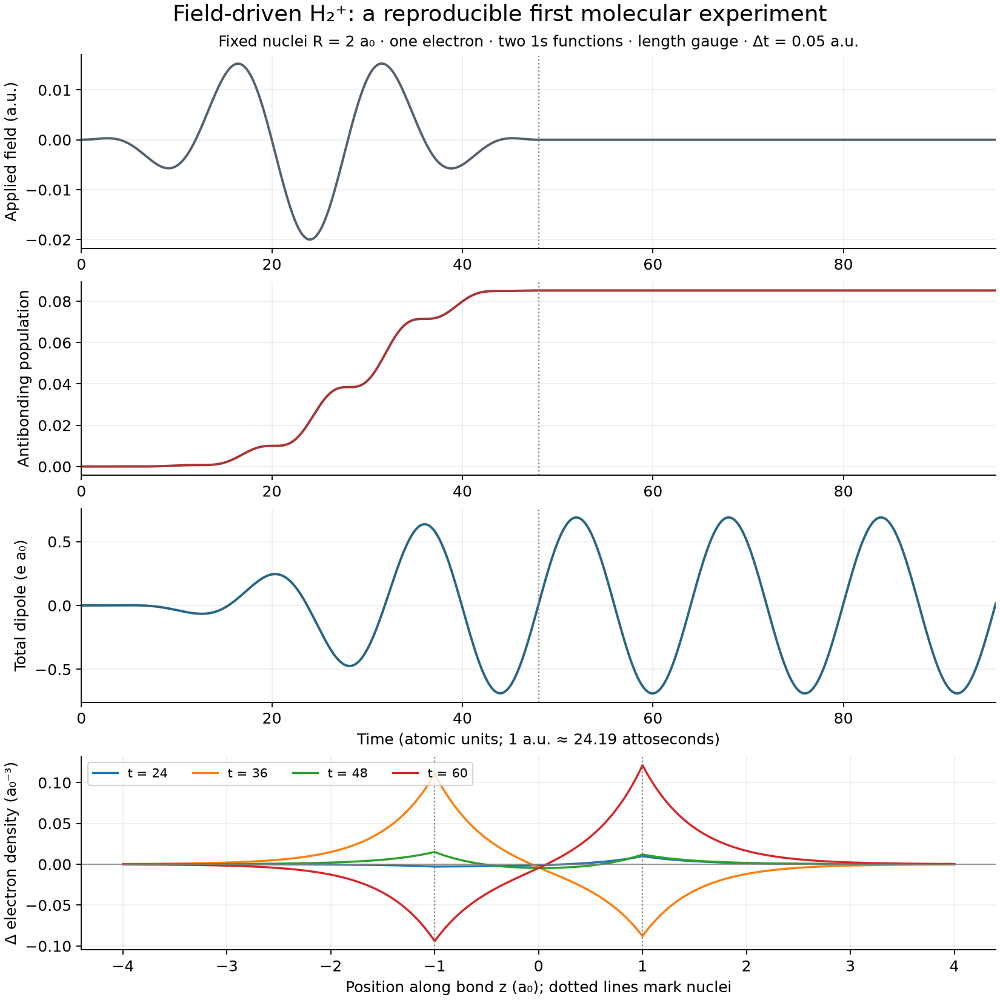

# Lambda Waves: math audit and molecular research

Astra · 5 September 2026 · working-tree audit, not a certification of every archived theorem

**Recommendation:** retain the exact finite-state quantum/classical mapping, strengthen the distinction between a wavefunction and electron density, and build molecular dynamics in independently validated stages. The present code already goes well beyond the original specification. Its two-centre integrals and variational machinery are useful foundations. The weakest link is the interpretation and transport of electronic states when the nuclei move.

This review produced code changes, counterexample tests, an independently checked field-driven H₂⁺ prototype, and independent H₂/benzene chemistry fixtures. The [implementation plan](MOLECULAR-PLAN.md) specifies the remaining work. The [source and corpus ledger](SOURCES-AND-COVERAGE.md) distinguishes source verification, existing numerical evidence, new proofs, and material that remains unverified.

## 1. What the app actually implements

| Component | Mathematical status | Consequence for molecules |
|---|---|---|
| `hydrogen.js`, `state.js` | Analytic hydrogen functions, finite register; model-dependent projected field Hamiltonians | Excellent atomic teaching/reference path; 91 functions are not a complete molecular Hilbert space |
| `shadow.js` | Exact realification of finite Hermitian Schrödinger dynamics | Preserve this; it generalises to any finite electronic Hamiltonian |
| `frontier.js`, `orbit.js` | SO(4) representation and rotor expectations; previously overclaimed rank-one classification | Classification corrected in this audit |
| `molecule.js` | Analytic one-electron, two-1s LCAO H₂⁺ | Controlled toy/reference, not a general chemical bond solver |
| `twocentre.js`, `sturmian.js`, `mo.js` | Nonorthogonal two-centre variational basis; numerical integrals/eigensolver; electrostatic and Pulay terms | Stronger one-electron foundation, but axial geometry and one-electron Hamiltonian are structural restrictions |
| `h2.js` | Heitler–London singlet/triplet model and BO nuclear trajectories | Useful correlated H₂ lesson; not a many-atom engine |
| `atoms.js` | Self-consistent radial Xα model with Latter tail; element orbitals | Atomic library/initial guesses; joining these orbitals does not solve the molecular electronic problem |
| `field.js` | Orbital-field rendering, including grouped density contributions | Reuse rendering infrastructure with explicit density/occupation semantics |
| `mo.js:createDynamics` | BO stepping or electronic propagation with omitted moving-basis coupling, followed by normalisation | Current “Ehrenfest” path is incomplete; do not certify it from its norm or Pulay integral |
| New `modrive.js` | One electron, fixed nuclei, longitudinal electric pulse, finite LCAO, exponential midpoint | Numerically validated starting experiment; headless module, not yet wired to controls |

The older “FOR-JOSH” digest describes work as unimplemented that now exists in the Round 4 build. Plan against the executable working tree, not that digest alone. The repository was extensively dirty before this audit; no reset, commit, deployment, or unrelated rewrite was performed.

## 2. Preserve the strongest mathematical idea

Write a Hermitian matrix as H = A + iB, with A real symmetric and B real antisymmetric. For c = (q + ip)/√2,

\[
 i\dot c=Hc \quad\Longleftrightarrow\quad
 \dot q=Ap+Bq,\qquad \dot p=-Aq+Bp.
\]

These are Hamilton's equations for

\[
 \mathcal H(q,p)=\tfrac12q^TAq+\tfrac12p^TAp+p^TBq=c^\dagger Hc.
\]

The derivation is direct substitution. It is exact for the selected finite linear quantum model, including complex Hermitian couplings. The classical coordinates encode amplitudes; they are not electron positions. This is the defensible core of “quantum waves visualised through classical interaction.” The existing shadow tests exercise the complex as well as real case. Skinner provides a closely related arbitrary-N oscillator construction. [Skinner, exact classical oscillator mapping](https://arxiv.org/abs/1302.0754).

For nonorthogonal atomic orbitals, first remove the metric. If S = LL†, set a = L†c and h = L⁻¹HL⁻†. Then a†a = c†Sc and iȧ = ha for a fixed basis. Apply the existing shadow mapping to a, not raw AO coefficients. Cholesky requires positive definiteness; near-linear dependence requires an explicit overlap eigenspace cutoff and a reported retained rank.

For self-consistent Hartree–Fock/DFT, the Fock/Kohn–Sham operator depends on density. The canonical Hamiltonian must be the electronic energy functional. In particular, Tr(DF) generally double-counts interactions and is not the total electronic energy. The exact linear shadow does not automatically prove a nonlinear force implementation correct.

## 3. A theorem in the corpus is false, and the app label was affected

The September 3 print, Theorem B.1 and its abstract, identifies all rank-one Clebsch matrices with spin-coherent SO(4) states and calls their Schmidt spectra complete SO(4) invariants. Both statements fail for n ≥ 3.

Within shell n, j = (n−1)/2 and the state space is Vj ⊗ Vj. The physical rotor action uses the spin-j representation of SU(2) on each factor. General singular-value decomposition allows the much larger U(n) action. Invariants under the larger group remain invariants under the subgroup, but need not distinguish subgroup orbits.

**Constructive counterexample at n = 3:** compare |1,0⟩⊗|1,0⟩ with |1,1⟩⊗|1,1⟩. Both have Schmidt spectrum (1,0,0). In the first, both spin expectations have length zero. In the second, both have length one. Rotations preserve these lengths. The states cannot share an SO(4) orbit; only the latter is spin coherent.

All separable pure states form CP^(n−1) × CP^(n−1), of real dimension 4(n−1). The coherent product subset is S² × S², of dimension four for j > 0. At n = 2 the factors coincide; extrapolating that special case caused the error.

**Sufficient and necessary pure-state test:** both |⟨J₊⟩| and |⟨J₋⟩| equal j. To see sufficiency, choose an axis along each expectation. Saturating the maximum eigenvalue j of that spin component forces its reduced state into the nondegenerate highest-weight eigenspace. The pure joint state is therefore the product of two spin-coherent states. Necessity follows by rotation from that highest-weight product. Empty registers require a separate check; j = 0 is trivial when populated.

Implemented `shellCharacter` and three UI categories: coherent, separable but not coherent, and entangled. [Counterexample and invariance test](../../tests/math-audit.test.mjs) also checks actual register/rotor conversions and the n = 1,2 limits.

A second historical error is the print's ⟨z⟩ = −3 tanh(2θ) for unitary Kz evolution of 2s. Unitary mixing produces a relative imaginary amplitude; with real z matrix elements its dipole remains zero. Hyperbolic filtering is not that unitary motion. Current rotor tests already support the zero-dipole result. Preserve the print as history with an explicit correction notice.

The coherent Kepler correspondence uses e = |⟨K⟩|/n = ((n−1)/n)sin(γ/2). It is an illustrative correspondence of expectation values, not a proof that the density follows a single classical ellipse or that all separable states are Kepler packets.

## 4. The missing term in moving molecular orbitals

For ψ = Σμ χμ(R(t))cμ(t), projection of the TDSE gives

\[
 iS\dot c=(H-i\tau)c,\qquad
 \tau_{\mu\nu}=\langle\chi_\mu|\dot\chi_\nu\rangle,
 \qquad \dot S=\tau+\tau^\dagger.
\]

Consequently d(c†Sc)/dt = 0 for Hermitian H. Omitting τ instead gives d(c†Sc)/dt = c†Ṡc. Reducing the timestep converges to the wrong equation; normalising every step repairs one scalar while discarding information about the missing transport. The app currently carries AO coefficients from one separation into the next, propagates using the new metric, then normalises. [Artacho and O'Regan, evolving Hilbert spaces](https://arxiv.org/abs/1608.05300); [DFTB+ electronic dynamics equations](https://dftbplus-recipes.readthedocs.io/en/stable/electronicdynamics/introduction.html).

This is nonzero even in the one-dimensional gerade sector. For normalised 1s bonding coefficients at R₀, hold the coefficients fixed and vary R:

\[
 N(R)=\frac{1+S(R)}{1+S(R_0)},\quad
 S(R)=e^{-R}(1+R+R^2/3),\quad
 N'(R_0)=\frac{-e^{-R_0}R_0(1+R_0)/3}{1+S(R_0)}.
\]

At R₀ = 2, the slope is **−0.170613679949 per bohr**. The new test obtains the same result by finite differences of the actual basis. The previous comment that symmetry makes the leak zero was incorrect; unchanged populations after renormalisation do not imply zero connection.

An overlap-based transport scheme can approximate this geometry. But cross-overlap projection between finite spaces can lose norm because the represented subspaces differ; polar-unitary transport chooses a metric-preserving approximation. It must report projection loss and rank changes, not disguise them. Analytic derivative coupling or a fixed laboratory basis provides another route.

The app's `adiabaticGap` is excess electronic energy above the instantaneous BO ground state. Physical excitation also produces that quantity. It is **not** an estimator of omitted nonadiabatic coupling.

## 5. What the Pulay inequality does and does not prove

For a normalised trial ψ(R), define r = (H−E)ψ. Differentiating E = ⟨ψ|H|ψ⟩ gives

\[
 E'=\langle\partial_RH\rangle+2\Re\langle\partial_R\psi|r\rangle.
\]

The second term P satisfies |P| ≤ 2‖∂Rψ⊥‖‖r‖, by Cauchy–Schwarz and ⟨ψ|r⟩ = 0. The code's force relation is Fgradient = Felectrostatic − P, with nuclear repulsion included consistently.

On a smooth BO branch, in continuous nuclear dynamics driven by the electrostatic force, d(Tnuc + EBO)/dt = P Ṙ. Its accumulated model contribution is bounded by ∫|Ṙ| bound dt. This statement does not include Verlet truncation, quadrature error, eigenvector branch/rank changes, the omitted electronic connection, or boundary clamps. Numerically integrating an estimated bound is not a rigorous certificate of the continuous integral either.

Changed `mo.js` documentation and `moview.js` wording: the display is now a comparison, the incomplete Ehrenfest option carries an asterisk, and a small drift no longer earns a green certification from this inequality. The underlying moving-nucleus algorithm remains to be repaired.

For an S-normalised, converged generalised eigenvector, the equivalent finite-matrix force is −c†(∂RH − E∂RS)c, plus the nuclear term. Do not reduce “Pulay” to overlap differentiation alone: ∂RH also contains basis derivatives. For multi-electron models, derive the complete force from the same electronic energy functional used to solve the state.

The existing dt = 500 clamp test establishes that the program returns finite numbers. Its very large energy is not evidence of acceptable dynamics. Boundary crossings should terminate or reject a physical integration step; keeping the velocity after clipping R is an artificial intervention.

## 6. The new field-driven proof of concept

[Implementation](../../lab/modrive.js) · [tests](../../tests/modrive.test.mjs) · [independent reference generator](reference-drive.py) · [reference data](reference-drive.json)

For fixed R and a longitudinal electric field, the implemented model is

\[
 iS\dot c=[H_0+E_z(t)Z]c,\qquad Z_{\mu\nu}=\langle\chi_\mu|z|\chi_\nu\rangle.
\]

The plus sign is the electron's length-gauge potential-energy convention. The total molecular dipole is ΣA ZA RA − ⟨r⟩. Nuclear repulsion is added exactly once to the displayed total energy. Nuclear coupling to the uniform field is a scalar at fixed geometry and does not affect electronic density.

`twocentre.js` now assembles Z on its existing quadrature. The electric field mixes gerade and ungerade states, so propagation uses the full generalised eigenproblem instead of the zero-field parity blocks. Each midpoint Hamiltonian is exponentiated; this preserves the S metric to solver/roundoff precision without renormalisation. For constant field it gives the exact finite-matrix solution; for varying field it has second-order global accuracy. Singular/removed-rank bases are rejected explicitly by this prototype.

The independent oracle uses closed-form 1s LCAO energies and dipole integrals, plus SciPy DOP853. It imports no app code, splits the integration at the pulse boundary, and compares two tight tolerance settings. Their largest amplitude difference is 1.62×10⁻¹². The JS test compares actual complex AO amplitudes, not merely populations or conserved norm.

| Δt (atomic units) | Maximum real/imaginary coefficient error against oracle | Maximum sampled norm error |
|---:|---:|---:|
| 0.20 | 9.2733×10⁻⁵ | 4.04×10⁻¹⁴ |
| 0.10 | 2.3185×10⁻⁵ | 4.00×10⁻¹⁴ |
| 0.05 | 5.7963×10⁻⁶ | 1.42×10⁻¹³ |

Halving Δt divides error by about four. Additional tests check the closed dipole integrals, the entire constant-field two-level population formula, total energy in a static field, time reversal, field-sign reversal, immutable density snapshots, invalid inputs, and norm preservation/excitation in a 12-function Sturmian basis.

This plot comes from the new JS solver. The pulse leaves an excited population and a freely oscillating dipole; population and dipole are different observables. It is not a ChronusQ comparison, basis-converged spectroscopy, ionisation simulation, or full molecular app integration. A finite bound basis can return excited amplitude but cannot faithfully represent an escaping electron. The 12-function test checks numerical structure, not convergence of all physical observables.

## 7. From one electron to an actual molecule

“Add atoms” means choosing nuclear charges/positions, total charge and spin, then solving a new electronic state. Neutral molecule electron count is ΣZ; with charge Q it is Ne = ΣZ − Q. A drawn bond is an interpretation of the solution, not a missing Coulomb term supplied by a line between atoms.

With occupied spatial orbitals φα = Σμ χμ Cμα and occupations fα,

\[
 D=CfC^\dagger,\qquad
 n(\mathbf r)=\sum_\alpha f_\alpha|\phi_\alpha(\mathbf r)|^2,
 \qquad \operatorname{Tr}(DS)=N_e.
\]

For complex AOs the matrix-index convention must reproduce this orbital sum explicitly. Store the convention in the fixture schema. Distinct occupied electrons are not a coherent sum of occupied orbitals. The cross terms in |Σα√fα φα|² are generally spurious. The atomic “fill the valence” coherent register is therefore not a many-electron density.

For a closed-shell determinant, C†SC = I and spin-summed DSD = 2D. For separate spin densities, DαSDα = Dα and likewise β. A correlated one-particle density generally has fractional natural occupations and is not idempotent; testing idempotency there would reject valid physics.

For real-time SCF in an orthonormal basis, iṖ = [F(P,t),P]. A midpoint Fock matrix must be predicted/corrected or solved self-consistently. An exponential of an old Fock matrix can preserve norm while giving poor response and energy balance. A frozen Fock calculation is an explicitly different approximation.

Rotations among equally occupied orbitals leave the density unchanged. Animating individual orbital phases/degenerate-orbital rotations can produce attractive movement with no charge motion. Show selected orbital phase as a basis-dependent view; use n(r,t), Δn(r,t), dipole, current and excitation populations for physical response. Parallel-transport gauges are useful for reducing unnecessary orbital motion and potentially integration cost; they are a different gauge issue from the AO connection above. [Jia, An, Wang and Lin](https://arxiv.org/abs/1805.10575).

For a coherent superposition of many-electron states, n(r,t) = ΣIJ aI* aJ nIJ(r), using transition densities nIJ. Replacing many-body amplitudes with coefficients in one orbital renderer is not equivalent.

## 8. What the independent chemistry experiment says

[Generator](chemistry-reference.py) · [results](chemistry-reference.json) · [benzene Molden fixture](benzene-sto3g.molden)

PySCF 2.14.0 was installed into an isolated `/tmp` target, not into the app or a shared environment. Calculations used two CPU threads, STO-3G and fixed input geometries. Energy values include nuclear repulsion. The benzene geometry is a regular planar hexagon with C–C = 1.397 Å and C–H = 1.080 Å; it was not optimised.

| System | RHF total (hartree) | FCI in the same basis (hartree) |
|---|---:|---:|
| H₂, 0.74 Å | −1.116759307396 | −1.137283834489 |
| H₂, 3.00 Å | −0.656048251146 | −0.933631844558 |
| Benzene, fixed geometry | −227.890568878576 | Not run |

At stretched H₂, the RHF–FCI difference is about 0.278 hartree: converging the SCF equations is not the same as obtaining the right bonding physics. FCI here is exact only within STO-3G and the clamped-nucleus electronic model.

The benzene fixture has 36 AOs, 42 electrons and 21 occupied spatial orbitals. Tr(DS) = 42.00000000000001, maximum C†SC−I entry ≈ 2.96×10⁻¹⁴, maximum FDS−SDF entry ≈ 2.01×10⁻⁹, and closed-shell idempotency error ≈ 5.86×10⁻¹⁴. This SCF run took 0.161 seconds on this machine, excluding imports, molecule construction and rendering. It is one local feasibility measurement, not a browser/mobile performance claim.

This supports a practical separation: a mature chemistry backend supplies reliable integrals/states, and the browser makes them explorable. PySCF exposes both mean-field and correlated methods needed for reference fixtures. [PySCF SCF documentation](https://pyscf.org/user/scf.html); [FCI and integral interfaces](https://pyscf.org/quickstart.html).

## 9. Fields, particles and remaining interpretation risks

**Projected dynamics and local continuity.** For r = (Hfull − i∂t)ψ and the usual local scalar Hamiltonian current j = Im(ψ*∇ψ), direct substitution gives

\[
 \partial_t|\psi|^2+\nabla\cdot\mathbf j=-2\Im(\psi^*r).
\]

Projection can make the integrated residual vanish without making the local residual zero. A norm-preserving finite-basis propagator therefore does not prove exact local continuity for its reconstructed wavefunction. This matters when using its density/current as electromagnetic sources or generating Bohm-style density tracers. Add a local continuity diagnostic before extending those claims to molecular bases.

**Particle rendering.** The existing speed cap, finite seeding box, empirical rejection envelope and omitted rendered modes affect the tracer ensemble. Equivariance is an exact continuum statement under the matching Schrödinger/current equations, not a guarantee for capped trajectories or a guessed rejection upper bound. For many electrons, j/n can visualise one-body flow, but is not the full configuration-space Bohmian trajectory of an interacting N-electron wavefunction.

**Magnetic fields.** Carry charge signs and gauge conventions through the current. In atomic units with H = (−i∇+A)²/2 + V, the electron probability current includes +A n. Keeping only Im(ψ*∇ψ) in that convention omits the diamagnetic contribution. Weak Zeeman-only teaching models should state their scope.

**Internal electromagnetic sources.** Use the actual distributed charge/current near a molecule. The early literature digest's 6.3 T point-dipole estimate inside an orbital is superseded by the later distributed-source calculation (about −0.429533 T at z = 1 a₀ for the specified 2p₊ case). A far-source dipole formula is not a near-source benchmark. Retardation requires its own expansion in kr and observation/source geometry; avoid a universal percentage justified only by wavelength versus atomic radius.

**Radiation.** A stationary state can have circulating current without radiating. A prescribed external driving field, classical radiation from mean density/current, spontaneous emission, and radiation reaction are different models. Do not turn all four on through the same “field” switch or double-count a driving field. Strong-field/ionisation validation eventually needs diffuse/continuum functions or a grid, boundaries and flux observables. [tRecX methods and scope](https://arxiv.org/abs/2101.08171).

**Atomic self-consistency.** Radial Xα/Latter orbitals are useful and inexpensive. Orbital energies are not generally measured ionisation energies; ΔSCF is a separate calculation. A manually corrected potential tail is not automatically the derivative of the energy functional used elsewhere. A future force implementation must use a consistent functional or clearly expose the approximation.

**Basis completeness.** A common-scale infinite Sturmian tower can be complete; a finite 91-function truncation cannot represent arbitrary translated cusps, continuum tails or all multi-centre states exactly. More functions with a badly chosen radial scale may converge very slowly. The existing two-centre tests already demonstrate why radial flexibility matters more than the count alone.

**Archived research.** The cubic/Airy envelope has exact identities within its reduced model; this does not make the full Coulomb revival spectrum cubic. A finite-field shell theorem is not a molecular electronic-structure result. The QCD analogies are separate pedagogical models. No new blanket certification of these branches is claimed here.

## 10. Validation record and changes

`bash test.sh node` exited **0** after the changes: all 29 pre-existing suites and both new suites passed. Full output is in [node-validation.log](node-validation.log). The initial baseline had one particle-trail failure; a standalone rerun and the final full run passed without a particle/test fix from this audit. Do not describe that intermittent baseline failure as repaired.

Browser setup found no available connection. Revised labels were inspected in source, but interactive layout/WebGPU/browser regression checks were not run in this audit. The generated scientific plot was visually inspected. Molecular controls are not yet connected to the new drive module.

Changed existing files: `frontier.js`, `orbit.js`, `index.html`, `twocentre.js`, `mo.js`, `moview.js`, and `test.sh`; added `modrive.js`, two tests and these research artifacts. About credits now link to ChronusQ and Electron Orbitals, with inspiration distinguished from a solver dependency. Historical print/report notices point to corrections. Pre-existing user work remains in place. [Input manifest](input-manifest.json) records the starting snapshot; the coverage ledger describes limits of the review.

The next release-quality proof should be a displayed H₂⁺ pulse with converged density/dipole and honest diagnostics. After that: correlated two-electron H₂, an arbitrary-centre static molecule importer/builder, fixed-nuclei many-electron response, then variationally consistent moving nuclei. Those steps preserve the app's mathematical character while making each new physical claim testable.
